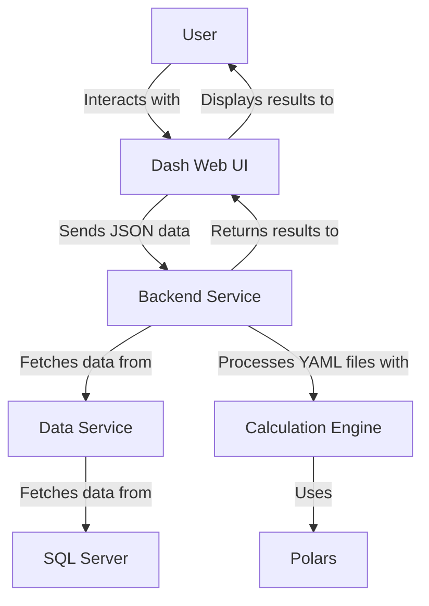

# **Analytics Calculation Engine**

This project provides a modular analytics calculation engine that allows you to plug in different YAML configurations to compute various analytics using Polars.




---

## **Table of Contents**

- [Overview](#overview)
- [Features](#features)
- [Getting Started](#getting-started)
  - [Prerequisites](#prerequisites)
  - [Installation](#installation)
- [Usage](#usage)
  - [Running the Metrics Runner](#running-the-metrics-runner)
  - [Generating Documentation](#generating-documentation)
  - [Running Regression Tests](#running-regression-tests)
- [Project Structure](#project-structure)
- [Customization](#customization)
- [License](#license)

---

## **Overview**

The analytics calculation engine is designed to process data based on instructions provided in YAML configuration files. It leverages **Polars** for data manipulation and supports **Sphinx** for documentation generation.

---

## **Features**

- Modular design with separation of data, configuration, and computation.
- Dynamic analytics calculations via YAML configurations.
- Regression testing capabilities with YAML support.
- Sphinx documentation for the codebase.

---

## **Getting Started**

### **Prerequisites**

- SQL Server database (e.g., SQL Server Docker container) to simulate database access.
- Python 3.7 or higher.
- Packages listed in `requirements.txt`.

---

### **Installation**

1. **Clone the Repository**  
   ```bash
   git clone https://github.com/maxicusj/polarparrot.git
   cd polarparrot
   ```

2. **Install Dependencies**  
   ```bash
   pip install -r requirements.txt
   ```

3. **Create Environment Configuration (.env)**  
   Create a `.env` file in the root directory with the following content:
   ```plaintext
   DB_SERVER=localhost
   DB_DATABASE=AdventureWorks
   DB_USERNAME=sa
   DB_PASSWORD=password
   ```

4. **Start Backend Services and Web UI**  
   Start the services with the provided script:
   ```bash
   ./start_services.sh
   ```
   Access the web UI at [http://localhost:8050](http://localhost:8050).

---

## **Usage**

### **Running the Metrics Runner**
Run the selected YAML metrics against mockup test data:
```bash
python metrics_runner.py analytics_list.json
```

### **Running Regression Tests**
Run regression on YAML metrics against mockup test data in data.py:
```bash
python regression_runner.py
```

### **Running the Unit Tests Runner**
Run the selected YAML metrics against mockup test data:
```bash
python unit_tests_runner.py
```

### **Running via CURL Command**  
   You can test the backend service with a sample request:
   ```bash
   curl -X POST http://localhost:8088/analytics \
   -H "Content-Type: application/json" \
   -d '{
     "positions_json": "[{\"instrument_id\": 1, \"weight_1\": 0.00005, \"weight_2\": 0.00004, \"weight_3\": 0.00003, \"weight_4\": 0.00005, \"is_laggard\": true}, {\"instrument_id\": 2, \"weight_1\": 0.00007, \"weight_2\": 0.00006, \"weight_3\": 0.00007, \"weight_4\": 0.00006, \"is_laggard\": false}, {\"instrument_id\": 3, \"weight_1\": 0.0001, \"weight_2\": 0.00008, \"weight_3\": 0.00002, \"weight_4\": 0.0001, \"is_laggard\": true}, {\"instrument_id\": 4, \"weight_1\": 0.00002, \"weight_2\": 0.00005, \"weight_3\": 0.00009, \"weight_4\": 0.00002, \"is_laggard\": true}, {\"instrument_id\": 5, \"weight_1\": 0.00009, \"weight_2\": 0.00007, \"weight_3\": 0.00005, \"weight_4\": 0.00007, \"is_laggard\": false}]", 
     "analytics_list_json": "{\"analytics\": [\"yaml/0002.yaml\", \"yaml/0004.yaml\"]}"
   }'
   ```

---

## **Project Structure**

- **`metrics_runner.py`**: Executes analytics calculations as per YAML configurations.
- **`regression_runner.py`**: Validates metrics using regression tests.
- **`start_services.sh`**: Starts backend services and the web UI.
- **`requirements.txt`**: Lists required Python packages.
- **`.env`**: Environment variables for database connection.

---

## **Customization**

You can customize this engine by:
- Adding new YAML files to the `yaml/` directory to define analytics configurations.
- Extending the Polars DataFrame manipulation logic in the `metrics_runner.py` file.

---

## **License**

This project is licensed under [MIT License](LICENSE).

---
